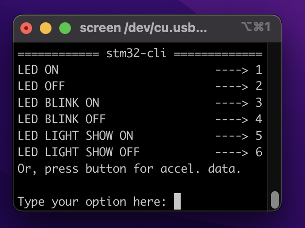

# stm32-cli
This is a FreeRTOS C project for the STM32F407 Discovery board that runs a number of GPIO tasks through a UART-driven command line interface. This project uses GoogleTest for unit testing.

## Getting Started

### Hardware Requirements
- STM32F407G-DISC1 Board 
    - Configurable to other STM32 setups but this project specifically uses on-board LEDs as well as on-board ST-MEMS accelerometer.
- USB-TTL Serial Converter - [Amazon](https://www.amazon.co.uk/gp/product/B07TFSZ3ZP/)
### Dependencies
- Docker
- Visual Studio Code
- [Visual Studio Code Remote Development Extension](https://marketplace.visualstudio.com/items?itemName=ms-vscode-remote.vscode-remote-extensionpack)

### Installation
To install run `git clone https://github.com/lukezsmith/stm32-cli` to clone the repository.

Following installation, open the directory in Visual Studio Code. 

Once the directory has been opened in Visual Studio Code, re-open the directory using the provided Docker container. It will take a while to install.

### Building
The template uses CMake to build the code. 
To automate the process there is a Makefile in the root directory which can be run to automate the build.

This template has cross-compilation set up. There is a test build which compiles on the host machine. I use this to unit test the code. To run this simply run `make` or `make TEST_MODE=TRUE` in the terminal from the root directory of the repository. The build will be saved in `/build/test`.

To build for the STM32 microcontroller run `make` to build a version for debugging. To create a release build run `make BUILD_TYPE=Release`. These build will be saved in `/build/release`.

### Flashing 
Included in the Makefile is a flash command to flash the program to the STM32.

To flash the release build to the microcontroller run `make flash`.

**NOTE:** I haven't yet implemented USB pass-through for flashing (or debugging) whilst in the development container so flashing will fail if ran in the container. A workaround is to simply run the flash command from your host machine after building the project in the container.

### Usage 
Once the program has been flashed to a STM32F407G discovery board, connect the USB-TTL serial converter's GND pin, connect RX pin to `PA2` pin, and TX pin to `PA3` pin.

From there, open serial monitor at baud rate `115200`.

The program's CLI will be visible (press reset button if CLI not visible):

To interact simply type the number of the command and press enter, alternatively press the blue USER button to log on-board accelerometer data. A demonstration video can be found at the bottom of this readme.

### Testing
This template includes GoogleTest. The process for adding test modules is explained above. Testing runs automatically when the test target is built with `make BUILD_TYPE=test`. There is also a Visual Studio Code Task included with this template that automatically runs the test build (and associated tests) when the task is run. For me the keyboard shortcut to run this task is `CMD+SHIFT+B`. This task can be found in `/.vscode/tasks.json`.

### Debugging
The project is ready for debugging via gdb through the `Debug` build. I usually use the [cortex-debug](https://marketplace.visualstudio.com/items?itemName=marus25.cortex-debug) Visual Studio Code extension. A configuration file for debugging with cortex-debug (with openocd, stlink) can be found at `.vscode/launch.json`. You will need to modify this file based on your debugging server/microcontroller setup.

### Demonstration
Below is a video demonstrating the program.

<iframe width="560" height="315" src="https://www.youtube.com/embed/vJsOST5cdj0" title="YouTube video player" frameborder="0" allow="accelerometer; autoplay; clipboard-write; encrypted-media; gyroscope; picture-in-picture" allowfullscreen></iframe>
